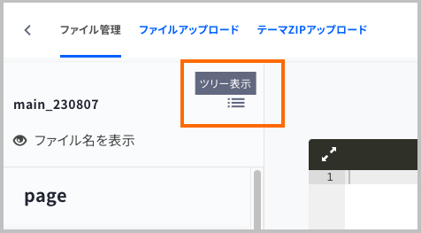
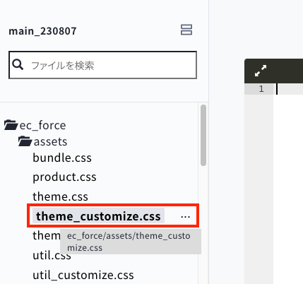

# 新規サイトの構築手順

## 1. テーマの追加
   最初はテーマが何も入っていないため、初期テンプレートを追加します。

   ショップ管理 > テーマ管理 > テーマライブラリ > テーマを追加 > 「various_items」をテーマへ追加<br>

   テーマ名を「main_YYMMDD」に編集します。<br>
   `YYMMDD`は作成時の年月日を入れてください。

   作成したテーマを適用してよいかどうかは案件によるため、必ずディレクターにご確認ください。<br>
   既にLPなどで運用している場合は、適用せず、プレビュー環境でコーディングを進めます。

## 2. フォルダの作成とファイルアップロード

   ファイルのアップロードは、作成したテーマ名の右「アクション」> コードの編集 にいき、タブの「ファイルアップロード」を選択します。

   

   初期状態では空の状態なので、フォルダを作成します。

   - `css`フォルダを作成し、空の`style.css`をアップロード

   - `js`フォルダを作成し、空の`script.js`をアップロード

   さらに、汎用クラスをまとめた`util_customize.css`を以下のコードをコピーして作成し、`css`フォルダにアップロードします。

```css
@charset "UTF-8";

/*=========================================*
* ecforce utility class
* SP breakpoint：719px
*==========================================*/


/*------------------------------------------*
* PC SP only
* example：<br class="sp-only">
*------------------------------------------*/
.sp-only {
  display: none;
}
@media screen and (max-width: 719px) {
  .sp-only {
    display: block;
  }
  .pc-only {
    display: none;
  }
}

/*------------------------------------------*
* flex
* example：class="flex -jc-center"
*------------------------------------------*/
.flex {display: flex;}
.flex.-jc-start {justify-content: flex-start;}
.flex.-jc-end {justify-content: flex-end;}
.flex.-jc-center {justify-content: center;}
.flex.-jc-between {justify-content: space-between;}
.flex.-al-start {align-items: flex-start;}
.flex.-al-end {align-items: flex-end;}
.flex.-al-center {align-items: center;}

/*------------------------------------------*
* width
*------------------------------------------*/
.w-10{width:10%;}
.w-15{width:15%;}
.w-20{width:20%;}
.w-25{width:25%;}
.w-30{width:30%;}
.w-35{width:35%;}
.w-40{width:40%;}
.w-45{width:45%;}
.w-50{width:50%;}
.w-55{width:55%;}
.w-60{width:60%;}
.w-65{width:65%;}
.w-70{width:70%;}
.w-75{width:75%;}
.w-80{width:80%;}
.w-85{width:85%;}
.w-90{width:90%;}
.w-95{width:95%;}
.w-100{width:100%;}

/*------------------------------------------*
* margin
* If more than 80px, it'll be 1/2 in SP
*------------------------------------------*/
/* margin-top */
.mt-10{margin-top:10px;}
.mt-15{margin-top:15px;}
.mt-20{margin-top:20px;}
.mt-25{margin-top:25px;}
.mt-30{margin-top:30px;}
.mt-35{margin-top:35px;}
.mt-40{margin-top:40px;}
.mt-45{margin-top:45px;}
.mt-50{margin-top:50px;}
.mt-55{margin-top:55px;}
.mt-60{margin-top:60px;}
.mt-65{margin-top:65px;}
.mt-70{margin-top:70px;}
.mt-75{margin-top:75px;}
.mt-80{margin-top:80px;}
.mt-85{margin-top:85px;}
.mt-90{margin-top:90px;}
.mt-95{margin-top:95px;}
.mt-100{margin-top:100px;}
.mt-120{margin-top:120px;}
.mt-140{margin-top:140px;}
.mt-160{margin-top:160px;}
.mt-180{margin-top:180px;}
.mt-200{margin-top:200px;}
@media screen and (max-width: 719px) {
  .mt-80{margin-top:40px;}
  .mt-85{margin-top:42.5px;}
  .mt-90{margin-top:45px;}
  .mt-95{margin-top:47.5px;}
  .mt-100{margin-top:50px;}
  .mt-120{margin-top:60px;}
  .mt-140{margin-top:70px;}
  .mt-160{margin-top:80px;}
  .mt-180{margin-top:90px;}
  .mt-200{margin-top:100px;}
}

/* margin-bottom */
.mb-10{margin-bottom:10px;}
.mb-15{margin-bottom:15px;}
.mb-20{margin-bottom:20px;}
.mb-25{margin-bottom:25px;}
.mb-30{margin-bottom:30px;}
.mb-35{margin-bottom:35px;}
.mb-40{margin-bottom:40px;}
.mb-45{margin-bottom:45px;}
.mb-50{margin-bottom:50px;}
.mb-55{margin-bottom:55px;}
.mb-60{margin-bottom:60px;}
.mb-65{margin-bottom:65px;}
.mb-70{margin-bottom:70px;}
.mb-75{margin-bottom:75px;}
.mb-80{margin-bottom:80px;}
.mb-85{margin-bottom:85px;}
.mb-90{margin-bottom:90px;}
.mb-95{margin-bottom:95px;}
.mb-100{margin-bottom:100px;}
.mb-120{margin-bottom:120px;}
.mb-140{margin-bottom:140px;}
.mb-160{margin-bottom:160px;}
.mb-180{margin-bottom:180px;}
.mb-200{margin-bottom:200px;}
@media screen and (max-width: 719px) {
  .mb-80{margin-bottom:40px;}
  .mb-85{margin-bottom:42.5px;}
  .mb-90{margin-bottom:45px;}
  .mb-95{margin-bottom:47.5px;}
  .mb-100{margin-bottom:50px;}
  .mb-120{margin-bottom:60px;}
  .mb-140{margin-bottom:70px;}
  .mb-160{margin-bottom:80px;}
  .mb-180{margin-bottom:90px;}
  .mb-200{margin-bottom:100px;}
}

/* margin-right */
.mr-10{margin-right:10px;}
.mr-15{margin-right:15px;}
.mr-20{margin-right:20px;}
.mr-25{margin-right:25px;}
.mr-30{margin-right:30px;}
.mr-35{margin-right:35px;}
.mr-40{margin-right:40px;}
.mr-45{margin-right:45px;}
.mr-50{margin-right:50px;}
.mr-55{margin-right:55px;}
.mr-60{margin-right:60px;}
.mr-65{margin-right:65px;}
.mr-70{margin-right:70px;}
.mr-75{margin-right:75px;}
.mr-80{margin-right:80px;}
.mr-85{margin-right:85px;}
.mr-90{margin-right:90px;}
.mr-95{margin-right:95px;}
.mr-100{margin-right:100px;}
.mr-120{margin-right:120px;}
.mr-140{margin-right:140px;}
.mr-160{margin-right:160px;}
.mr-180{margin-right:180px;}
.mr-200{margin-right:200px;}
@media screen and (max-width: 719px) {
  .mr-80{margin-right:40px;}
  .mr-85{margin-right:42.5px;}
  .mr-90{margin-right:45px;}
  .mr-95{margin-right:47.5px;}
  .mr-100{margin-right:50px;}
  .mr-120{margin-right:60px;}
  .mr-140{margin-right:70px;}
  .mr-160{margin-right:80px;}
  .mr-180{margin-right:90px;}
  .mr-200{margin-right:100px;}
}

/* margin-left */
.ml-10{margin-left:10px;}
.ml-15{margin-left:15px;}
.ml-20{margin-left:20px;}
.ml-25{margin-left:25px;}
.ml-30{margin-left:30px;}
.ml-35{margin-left:35px;}
.ml-40{margin-left:40px;}
.ml-45{margin-left:45px;}
.ml-50{margin-left:50px;}
.ml-55{margin-left:55px;}
.ml-60{margin-left:60px;}
.ml-65{margin-left:65px;}
.ml-70{margin-left:70px;}
.ml-75{margin-left:75px;}
.ml-80{margin-left:80px;}
.ml-85{margin-left:85px;}
.ml-90{margin-left:90px;}
.ml-95{margin-left:95px;}
.ml-100{margin-left:100px;}
.ml-120{margin-left:120px;}
.ml-140{margin-left:140px;}
.ml-160{margin-left:160px;}
.ml-180{margin-left:180px;}
.ml-200{margin-left:200px;}
@media screen and (max-width: 719px) {
  .ml-80{margin-left:40px;}
  .ml-85{margin-left:42.5px;}
  .ml-90{margin-left:45px;}
  .ml-95{margin-left:47.5px;}
  .ml-100{margin-left:50px;}
  .ml-120{margin-left:60px;}
  .ml-140{margin-left:70px;}
  .ml-160{margin-left:80px;}
  .ml-180{margin-left:90px;}
  .ml-200{margin-left:100px;}
}

/*------------------------------------------*
* font-size
*------------------------------------------*/
.f-6{font-size:6px!important;}
.f-7{font-size:7px!important;}
.f-8{font-size:8px!important;}
.f-9{font-size:9px!important;}
.f-10{font-size:10px!important;}
.f-11{font-size:11px!important;}
.f-12{font-size:12px!important;}
.f-13{font-size:13px!important;}
.f-14{font-size:14px!important;}
.f-15{font-size:15px!important;}
.f-16{font-size:16px!important;}
.f-17{font-size:17px!important;}
.f-18{font-size:18px!important;}
.f-19{font-size:19px!important;}
.f-20{font-size:20px!important;}
.f-21{font-size:21px!important;}
.f-22{font-size:22px!important;}
.f-23{font-size:23px!important;}
.f-24{font-size:24px!important;}
.f-25{font-size:25px!important;}
.f-26{font-size:26px!important;}
.f-27{font-size:27px!important;}
.f-28{font-size:28px!important;}
.f-29{font-size:29px!important;}
.f-30{font-size:30px!important;}
.f-31{font-size:31px!important;}
.f-32{font-size:32px!important;}

/*------------------------------------------*
* font-weight
*------------------------------------------*/
.fw-100{font-weight:100;}
.fw-200{font-weight:200;}
.fw-300{font-weight:300;}
.fw-400{font-weight:400;}
.fw-500{font-weight:500;}
.fw-600{font-weight:600;}
.fw-700{font-weight:700;}
.fw-800{font-weight:800;}
.fw-900{font-weight:900;}

/*------------------------------------------*
* text-align
*------------------------------------------*/
.ta-l{text-align:left;}
.ta-c{text-align:center;}
.ta-r{text-align:right;}
```

## 3. レイアウトテンプレートに読み込み記述を追加

   参考

   【購入ページ】   
   ec_force/shop/order.html.liquid?new=1

   【購入以外ページ】<br>
   ec_force/shop.html.liquid?new=1

   ※ レイアウトは上記2種類あるのでどちらにも記述ください

   CSS：14行目あたりで以下のように読み込みをしてください。
   <link rel="stylesheet" href="{{ file_root_path }}/css/style.css?{{ "now" | date: "%Y%m%d%H%M" }}">
   <link rel="stylesheet" href="{{ file_root_path }}/css/util_customize.css">

      ?{{ "now" | date: “%Y%m%d%H%M” }} は、キャッシュ対策です。開発完了したら削除します。

   JS：読み込み場所はどこでもよいですが、</body>の直前で読み込むのが安全です。


## 4. customize.cssの修正

   ecforceではブラウザからコードの編集が可能です。<br>
   タブのファイル管理に戻り「ツリー表示」をクリックします。<br>
   すると読み込まれているファイル名が一覧で表示されます。

   

   `theme_customize.css`をクリックします。

   

  （注意：util_customize.cssとは別ファイルです）

   このファイルは基本的には修正しないのですが、サイト全体に共通する以下の記述がありますので   

   - フォント系（書体、サイズ、太さ）
   - カラー
   - ボタン（背景色、角丸、枠線）

   セットアップ時にまとめて修正します。

   その際、漏れのないようご注意ください。

   具体的な修正方法は[こちら](theme-setup.md)を参照ください。


## 5. ヘッダー・フッターのコーディング

## 6. その他ページのコーディング