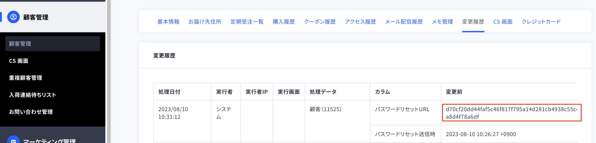

パスワードリセット → 再設定の画面をコーディングする際、
パスワードリセットしてもメールが届かずページを確認できない場合があります。

以下の手順で確認できるようになります。

1. パスワードリセットページからフォームを送信する 
    ※ここでメールが届かないためパスワード再設定画面に進めません。

2. 管理画面 / 顧客管理から自分のアカウントを開くと、変更履歴の場所にコードが発行されています。

3. 発行されたコードを下記URLの「トークン」に入れるとページ確認ができます。

`/shop/customers/password/edit?reset_password_token=[トークン]`

